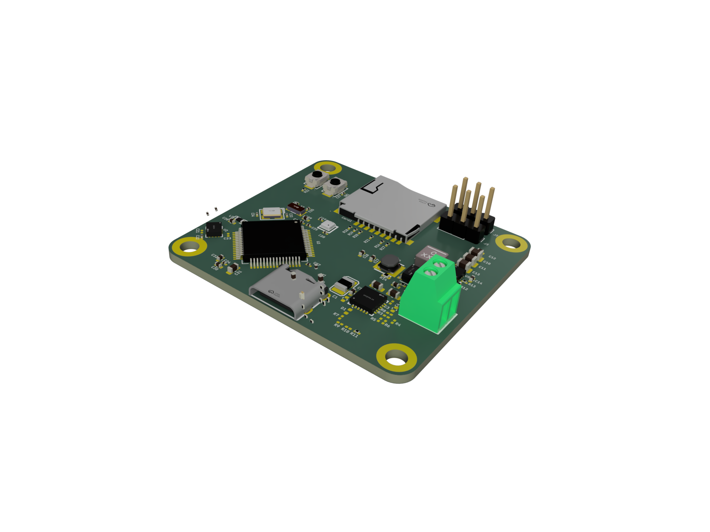
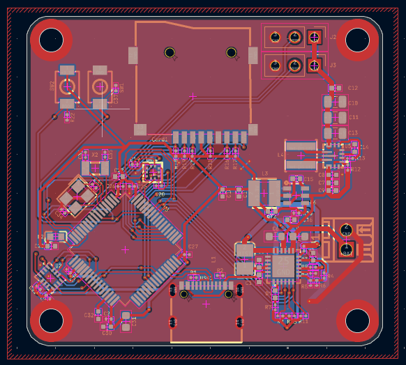
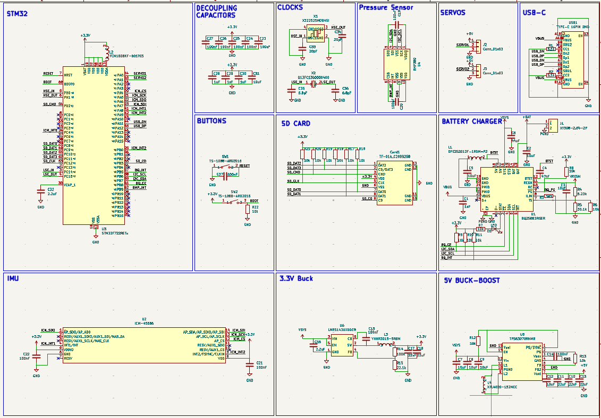

# My Simple Flight Controller
Made by following a tutorial by @notaroomba

    
    

## I learnt:
- That you can route sections of a pcb the bring them together to finish
- How to do ground fill in KiCAD
- That texas instruments is a good site to look on

## Features
| Name | Description | Part Name | Usage |
| --- | --- | --- | --- |
| MCU | High Speed MCU | STM32F722RET6 | This is the brains and allows management of all the other components connected to it |
| Barometer | For relative height measuring from launch altitude | BMP580 | This allows altitude tracking for each flight mission |
| IMU | Tracks movement | ICM-45686 | This allows tracking of the flight path and orientation of the craft using the 3 axis gyroscope in it |
| Battery Charger | Manages battery charging for Lithium Batteries | BQ25883RGER | This manages the battery and allows smooth discharge and charging of the battery to prevent damage to the battery and the board |
| High speed clock | Provides high-speed frequency to MCU (~25MHz) | X322525MOB4SI | This provides the main clock signal for the MCU |
| Low speed clock | Provides low-speed frequency to MCU (32.768kHz) | Q13FC13500004 | This provides a stable time base for the MCU |
| Battery Screw Terminal | For connecting battery | XY308-2.54-2P | This allows easy connection of the battery to the board (no soldering today) |
| Two servo pin headers | For connecting the servos | 2.54-1*3P | This allows easy connection of the servos to the board allowing hot swapping servos or cables |

## Getting Started
Click [here](GETTING_STARTED.md)

## BOM
[BOM](./BOM.csv)

[PCB BOM](./PCB_BOM.csv)

[PCB BOM UNSELECTED](./PCB_BOM_UNSELECTED.csv) - Most due to not being in stock or I couldn't find them on lcsc
